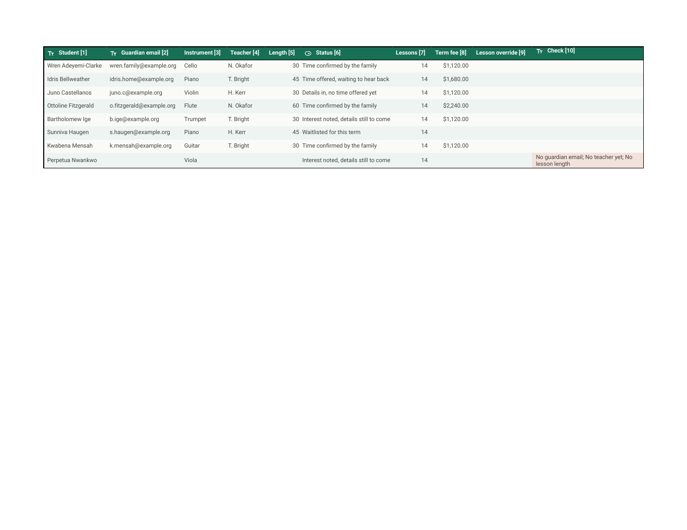

# gsheets-pro

**Pre-release, v0.1 not tagged yet.** The server, the skill, and the tests
below are real and live tested; nothing has been published to npm, the MCP
registry, or a plugin marketplace.

Google Sheets for an agent that can already think. Thirteen tools build
spreadsheets a colleague would recognize as their own, check the work
through the API rather than by guessing, render a tab so the agent can look
at what it built, and refuse to wreck a sheet other people edit.

<!--
  This must be a real browser screenshot of the shared golden sheet (see
  scripts/demo/build-golden.mjs), not a mockup. It is regenerated as the
  golden build changes; only the path here should stay fixed.
-->


That sheet is real and public: [open the demo spreadsheet](https://docs.google.com/spreadsheets/d/1HII7AoE8OBxEUu1_cxlEa8XHpdvJpb-MVGuZCwBu0hE/edit) (view only, every name invented). It was built by `scripts/demo/build-golden.mjs` using only the plugin's own tools, and the image is a browser screenshot of it.

## What it does

Every serious Sheets MCP server stops at values: the most-starred community
server, Anthropic's own connector, and Google's official Sheets MCP all
read and write cells well and format nothing. This one starts where they
stop.

### Formatting and native Tables, as first-class tools

Themes, banding, typed Table columns, header notes, named ranges, and a
Settings block for inputs, all addressed by sheet name and A1 range rather
than raw ids and grid coordinates. A dropdown a person colored by hand in
the Sheets interface is never rewritten, because the API cannot read those
colors back to save them first. `sheets_validation` refuses, every time,
until someone passes `force`:

```
code     ui_owned
message  Column D already carries a validation rule this plugin did not
         create.
hint     Rewriting it would discard the chip colors somebody set in the
         Sheets interface. That is measured, not a precaution: an
         identical rewrite wiped them in testing. Leave the rule alone,
         or pass force if losing the colors is acceptable.
```

### A verify loop

Every write ends with a read of what it touched, straight from the API.
`sheets_check` lints the whole sheet against seven rules (formula errors,
merges inside data, a missing frozen header, writes outside your columns,
and more) and returns a recalculation-shaped report:

```
status          success
total_formulas  41
total_errors    0
error_summary   {}
```

`sheets_render` turns a tab into a PNG so the agent can look at what it
built, once, before it says done. It never returns image bytes over MCP: a
local file path, or a short-lived signed URL when the server is hosted.

### Coexistence with humans

A registry in your own repository names the spreadsheets other people
depend on and what is load bearing about them. A hook checks it before
every call: it asks on a laptop, and in an unattended run it denies with
the reason, because an unanswered prompt just stalls a scheduled run.

```
code     contract_violation
message  sort is refused on "Private Lessons": the registry marks its
         rows as positional.
hint     Rows here are referred to by position somewhere else, so
         sorting, inserting, deleting, or moving them would silently
         invalidate that. Change the values in place instead.
```

## Install

Three environments, three different answers, because a stdio server
cannot run in a Claude Code cloud session at all.

**Laptop, stdio.** The skill, hooks, and presets, plus the bundled server.
Then run the setup skill for the OAuth walkthrough.

```sh
claude plugin marketplace add jordfan/gsheets-pro
claude plugin install gsheets-pro@gsheets-pro gsheets-pro-local@gsheets-pro
```

**A repository whose runs happen in the cloud, vendored.** Cloud sessions
load a repository's own skills and hooks but not a plugin declared in its
settings, so this copies the guide in and merges the hook entries. Commit
the result; a scheduled run gets a fresh clone.

```sh
npx gsheets-pro vendor .
```

**A server your team shares, HTTP.** Stateless HTTP behind a bearer token,
with a Dockerfile and a hosting guide in the repo. Point a cloud session's
`.mcp.json` at it.

```sh
GSHEETS_PRO_TOKEN=... npx gsheets-pro serve --http
```

## Setup

Start with `npx gsheets-pro doctor`. It reports what it finds: whether a
token exists, which scopes it carries, how the consent screen is
configured, and whether rendering's dependency is installed. The
`/gsheets-pro:setup` skill is the full walkthrough for both auth paths.

Path A, your own Google Cloud OAuth client, is the supported default and
takes about 25 minutes the first time, most of it in the Cloud Console.
**Click Publish app during setup.** Skip it and the consent screen stays in
Testing, where every refresh token it issues expires after seven days:
everything works for a week and then breaks with no obvious cause. Path B,
`gcloud auth application-default login` with the right scopes, needs no
OAuth client at all if you already have the gcloud CLI installed.

`docs/hosting.md` covers running the server for a team. `docs/cloud.md`
covers what is different about a Claude Code cloud session or a scheduled
routine: which parts load, which do not, and why the guard denies rather
than asks when nobody is watching.

## The tools

| Tool | What it does |
|---|---|
| `sheets_open` | First call every session: tabs, Tables, named ranges, protections, the detected preset, the contract, and any drift. Also creates a new spreadsheet from a preset. |
| `sheets_read` | Values, formulas, or both, with format, notes, and validation; paginates; finds across tabs and filters with `where`. |
| `sheets_write` | The only value mutation: range, append, upsert, fill, log, and a batch `rows` form. Refuses to overwrite a formula or a human-owned column without `force`. |
| `sheets_table` | Creates, adopts, updates, or deletes a native Table: typed columns, header notes, and preset header and band colors. |
| `sheets_settings` | A Settings and Assumptions block with auto named ranges, an input role, and warning-only protection. |
| `sheets_style` | One style object on one range, or the whole spreadsheet theme: borders, widths, banding, merge, sheet properties. |
| `sheets_validation` | Dropdown, checkbox, date, number, text, and custom rules. Refuses to rewrite a rule it did not create. |
| `sheets_conditional_format` | Lists, adds, updates, or deletes conditional format rules, addressed by fingerprint so they survive reordering. |
| `sheets_structure` | Tabs and dimensions: add, rename, move, hide, delete, sort, find and replace, dedupe, trim, group, protect. Destructive actions need confirmation. |
| `sheets_find` | The Drive side: list, search, share, and copy spreadsheets. |
| `sheets_batch` | The escape hatch to every `batchUpdate` request type, with sheet names and A1 ranges resolved server-side. |
| `sheets_check` | The lint: a recalculation-shaped report plus severity-tagged findings that each name the call that fixes them. |
| `sheets_render` | One tab or range to a PNG: a local file path, or a short-lived signed URL when hosted. Never image bytes. |

## Limits

Stated plainly, because the agent will find out anyway. The full list,
with the evidence behind each one, is `docs/LIMITATIONS.md`.

- Named functions and Apps Script are out of reach of the Sheets API entirely.
- Dropdown chip colors cannot be set or read through the API in either direction.
- A render never draws a dropdown as a pill; the lint is the authority on validation state, not a picture.
- Setup needs your own Google Cloud OAuth client and about 25 minutes the first time.
- No elicitation: every confirmation is an argument or a permission decision, never an interactive prompt from the server.
- A one-call declarative workbook builder and a formula pretty-printer are on the v1.1 roadmap, not in this release.

## How it was built

906 offline tests (vitest) run in about a second and need no credentials,
covering every tool, every lint rule, and both transports. A separate live
suite, 45 cases, runs against a disposable spreadsheet and skips itself
without one.

Six behaviors of the live Google Sheets API and the Claude Code cloud
environment were tested before the design was fixed, not assumed:
whether the render export tells the truth about formatting, what actually
happens in a cloud session and a scheduled routine, whether native Tables
are safe to build on, whether rewriting a dropdown preserves colors a
person set by hand, whether developer metadata survives a copy, and
whether stateless HTTP holds up under concurrent traffic with no
handshake. Two of the six caught a silent-data-loss behavior a naive
implementation would have shipped. The full verdicts, with the scripts
that produced them, are in `docs/spikes.md`; the cloud-session findings
are in `docs/cloud.md`.

## Contributing

`CONTRIBUTING.md` covers running the offline and live test suites, the
live-suite pacing rule, and the docs-must-match-reality rule this project
holds itself to. Bug reports and feature requests have templates under
`.github/ISSUE_TEMPLATE/`. This project follows the Contributor Covenant,
in `CODE_OF_CONDUCT.md`. Report a security issue per `SECURITY.md` rather
than in a public issue.

## License

MIT. See `LICENSE`. `NOTICE` credits
[mcp-google-sheets](https://github.com/xing5/mcp-google-sheets) (MIT, Xing
Wu) for the value-tool patterns `sheets_open`, `sheets_read`, and
`sheets_write` follow; no code from that project was copied.

Not affiliated with the GSheetsPro coaching product.
